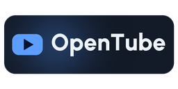
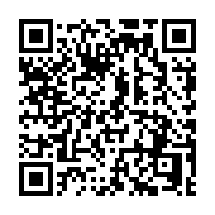

# OpenTube

Watch YouTube on your Nintendo 3DS or 2DS without opening the browser.

OpenTube is a fork of [FourthTube](https://github.com/erievs/FourthTube). It keeps the playback engine and gives the app a new interface, offline downloads and a few things to make it easier to use day to day.

**[Download CIA](https://github.com/krsvc/OpenTube/releases/latest/download/OpenTube.cia)** · [All downloads](https://github.com/krsvc/OpenTube/releases/latest)

## What's different?

- A redesigned interface with four themes: Glacier, Slate, Coral and Mint Ink.
- Download videos and watch them offline.
- Save liked videos on your console. These are local bookmarks, not likes on your YouTube account.
- Check for new OpenTube releases from the settings menu.

This is the first public beta. It works on the maintainer's console, but there are still rough edges. If something breaks, [open an issue](https://github.com/krsvc/OpenTube/issues) with your console model, app version and what happened.

## Install

You'll need a 3DS or 2DS running [Luma3DS](https://github.com/LumaTeam/Luma3DS), with DSP firmware dumped. You can [dump it from the Rosalina menu](https://3ds.hacks.guide/finalizing-setup.html) or use [DSP1](https://github.com/zoogie/DSP1).

### With FBI

Open **Remote Install > Scan QR Code** in FBI and scan this code to download and install the latest CIA:

### From your SD card

1. Download `OpenTube.cia` from the [latest release](https://github.com/krsvc/OpenTube/releases/latest).
2. Copy it to your SD card and install it with FBI.
3. Launch OpenTube from the HOME Menu.

The release also includes `SHA256SUMS` if you want to verify your download, and `OpenTube.3dsx` for the Homebrew Launcher. The 3DSX version needs manual updates.

## Before you start

- **Old 3DS / 2DS:** start with 144p. In one test video, 144p played smoothly while 240p stuttered. Performance varies by video.
- You'll still see the green FourthTube animation when the app launches. The launcher icon and banner are OpenTube's; the boot animation is unchanged.
- New 3DS interface testing and an update between two public releases are still outstanding.
- YouTube can change its internal APIs and break playback. This isn't an official YouTube or Nintendo app.

## Controls

In the video player:

- `A`: play / pause.
- D-pad left / right: back / forward 10 seconds.
- `ZL` / `ZR`: back / forward 5 seconds.
- `X` + `B`: stop playback.
- `B`: go back or close a sheet.
- `Y`: return to the full player while browsing.
- `START`: open the menu.

Tap **?** in the player's tab bar for the controls list. You can also close sheets by dragging their top edge down.

Testing, updates and saved data

### Testing so far

The CIA was checked on real hardware and accepted for normal use. The earlier build also passed login, video, audio, seeking and exit checks; the release build differs only in compile-time file paths. That isn't a full regression test. [Build and release details](Documentation/v0.16.1/README.md).

### Updates

Open **Settings > Update** to check for a newer release. The updater checks the CIA's checksum, title ID and version before asking you to install it. Updating between public releases hasn't been tested yet, so manual installation is the fallback.

A build that already reports version 0.16.1 won't offer this same version as an update. To replace a development build with the published one, install the CIA manually.

### Saved data

OpenTube uses `sd:/3ds/FourthTubeTest/` for settings, history, subscriptions, local likes, downloads and update staging. This is separate from FourthTube's data folder. Uninstalling the app doesn't remove it.

The app keeps small diagnostic logs on the SD card and doesn't upload them. If you sign into YouTube, its login tokens are also stored on the SD card.

### Earlier builds

Title ID: `000400000BF74E00`. Installing this CIA replaces OpenTube / FourthTube Test builds with the same ID. It can sit alongside the original FourthTube app.

Some internal labels still say "Beta 34.1 Test", and the About screen still links to FourthTube. The release version is 0.16.1. Some unsupported symbols and emoji appear as a `<?>` box.

## Build it yourself

See the [build instructions](Documentation/Build%20Instructions.md). They cover building OpenTube and rebuilding FFmpeg from the included source, then relinking the app.

## Credits

OpenTube builds on [FourthTube](https://github.com/erievs/FourthTube), [ThirdTube](https://github.com/windows-server-2003/ThirdTube) and [Video player for 3DS](https://github.com/Core-2-Extreme/Video_player_for_3DS). Thanks to their authors and contributors for the work this fork is based on. See [ATTRIBUTION.md](ATTRIBUTION.md) for the full credits.

OpenTube is independent of those projects and isn't endorsed by YouTube, Google or Nintendo.

## License

You can use, modify and share OpenTube under the GNU General Public License, version 3 or any later version. See [LICENSE](LICENSE) for the full terms. This beta comes with no warranty.

## Third-party licenses

- [FFmpeg](library/FFmpeg/FFmpeg): LGPL 2.1 or later. The modified source is included here, along with [instructions to rebuild it and relink OpenTube](Documentation/Build%20Instructions.md).
- [RapidJSON](library/rapidjson/license.txt): MIT.
- [libctru](licenses/libctru-2.7.0-README.md), [citro2d](licenses/citro2d-1.7.0-LICENSE) and [citro3d](licenses/citro3d-1.7.1-LICENSE): zlib license.
- [libcurl](licenses/curl-7.82.0-COPYING): curl license.
- [Brotli](licenses/brotli-1.0.9-LICENSE) and [nghttp2](licenses/nghttp2-1.64.0-COPYING): MIT.
- [stb_image](library/stb_image/LICENSE): MIT or public domain.
- [Mbed TLS](licenses/mbedtls-2.28.8-LICENSE): Apache 2.0 or GPL 2.0 or later.
- [zlib](licenses/zlib-1.3.1-LICENSE): zlib license.

The SDK and compiler runtime notices, full copyright texts and source details are in [NOTICE.md](NOTICE.md) and [licenses/](licenses/).
